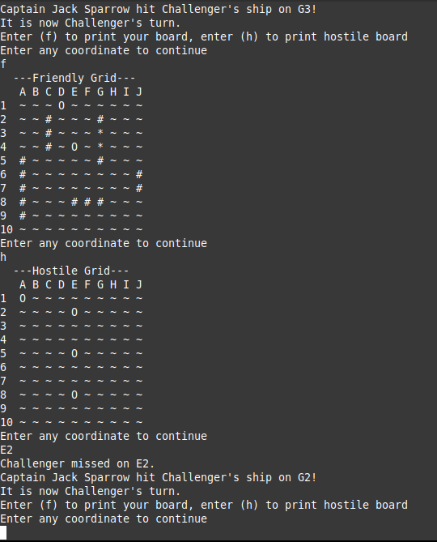
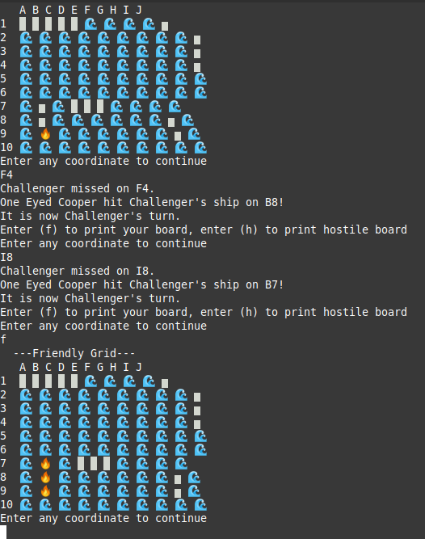

# Java-BattleShip

A complete battleship game running through the CLI created in java with audio

<p align=>
  
  
</p>

## Getting Started

These instructions will get you a copy of the project up and running on your local machine for development.

### Prerequisites

Battleship requires atleast java 8, to install version 8

```
sudo apt install openjdk-8-jdk-headless 
```

### Installing

How to get the Development Project Running <br>
First clone and move into this repository
```
git clone https://github.com/Grandduchy/Java-BattleShip
cd Java-BattleShip
```
Run the make file to create the class files and move music to the appropriate directory
```
chmod +x make
./make
```
Move to the bin file and run java with BattleShipGame

```
cd bin
java BattleShipGame
```

## Authors

* *Joshua Challenger* - *Compelte Project* - [Grandduchy](https://github.com/Grandduchy)

## License

This project is licensed under the MIT License - see the [LICENSE.md](LICENSE.md) file for details

## Acknowledgments

* [DataGeneric's Algorithm](http://www.datagenetics.com/blog/december32011) to find and hunt a battleship used for SmartAi
